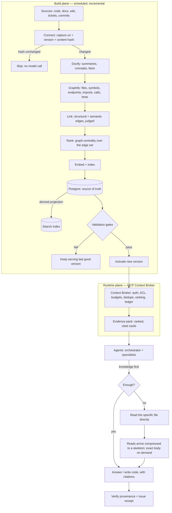

# Architecture

The platform is a cost-conscious, Postgres-first knowledge system served to coding agents through a
remote **MCP Context Broker**. It has two planes:

- **Build plane** — refreshes the knowledge base on a schedule and activates a new version only after
  validation passes.
- **Runtime plane** — serves the active knowledge base to agents through the Context Broker, enforcing
  budgets, access control, and provenance.

Postgres is the single source of truth. The search index is a derived, rebuildable projection — never
the truth.

## End-to-end flow

## Components

### Build plane

The build is **incremental and idempotent**. For each source it computes a content hash; if the hash
and generation inputs are unchanged, it does no model work at all. Changed sources flow through:

1. **Connect** — deterministic connectors capture each source's uri, version, and content hash.
2. **Docify** — prose (docs, wiki, tickets) is extracted into summaries, concepts, and source-backed
   facts. A claim whose supporting text is a verbatim substring of the source becomes a citable fact;
   otherwise it is interpreted knowledge that ranks below current sources.
3. **Graphify** — code is parsed into files, symbols, endpoints, imports, call edges, and test links.
4. **Link** — concepts are connected to code through deterministic matching, path conventions,
   embedding similarity, and a bounded relationship judge.
5. **Rank** — a graph-centrality score is computed over the edge set so structurally important nodes
   rank higher in retrieval.
6. **Embed + index** — vectors are stored in Postgres (so the index is rebuildable) and the search
   projection is upserted.
7. **Validate + activate** — a new knowledge-base version goes active only after index/retrieval
   consistency checks pass; otherwise the last good version keeps serving.

Every model call is gated by a content-addressed cache, and those model outputs are persisted durably
as they are produced — so a build interrupted partway through resumes without paying for the same work
twice.

### Runtime plane — the Context Broker

The Context Broker is the policy, retrieval, ranking, dedupe, evidence, and budget layer. It is not a
thin wrapper over search. For every request it:

- authenticates the caller and filters results by the caller's authorization before returning anything;
- ranks candidates by relevance, provenance, freshness, and graph centrality;
- removes near-duplicates and caps the result to a handful of evidence cards within a token budget;
- returns evidence as cards first, with exact source text available by handle;
- writes a retrieval event for every call (a full audit trail);
- treats all retrieved content as untrusted — it can never change tool policy, identity, or
  instructions.

### Agents

Agents are **knowledge-first, file-fallback**. For any task an agent consults the knowledge base first;
if that answers the question (or pins exactly which files matter), it uses and cites it. If the
knowledge base is missing, partial, or stale, the agent reads the specific files directly. Knowledge
search carries a per-task budget enforced in the tool, not the prompt. Code an agent reads arrives
**compressed to a skeleton** — signatures and types kept, bodies elided — so reading is cheap, with the
exact body one call away when needed.

## Invariants

1. Postgres is the source of truth; the search index is a derived, rebuildable projection.
2. The graph lives in Postgres tables; graph behaviour is exposed only through broker tools.
3. Token cost is controlled in code (a budget plus reversible compression), not by prompts.
4. The build is incremental: an unchanged content hash means no model call and no re-embedding.
5. A knowledge-base version goes active only after validation passes.
6. Agents hold no data-store credentials; retrieved content is untrusted.
7. Every served claim cites evidence; missing evidence becomes an open question, never an invention.
