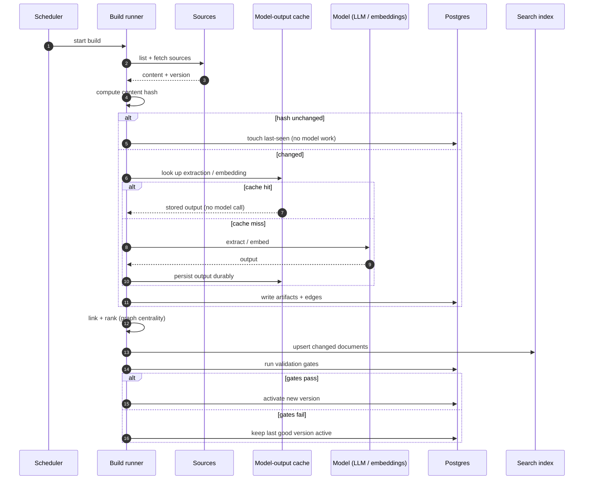
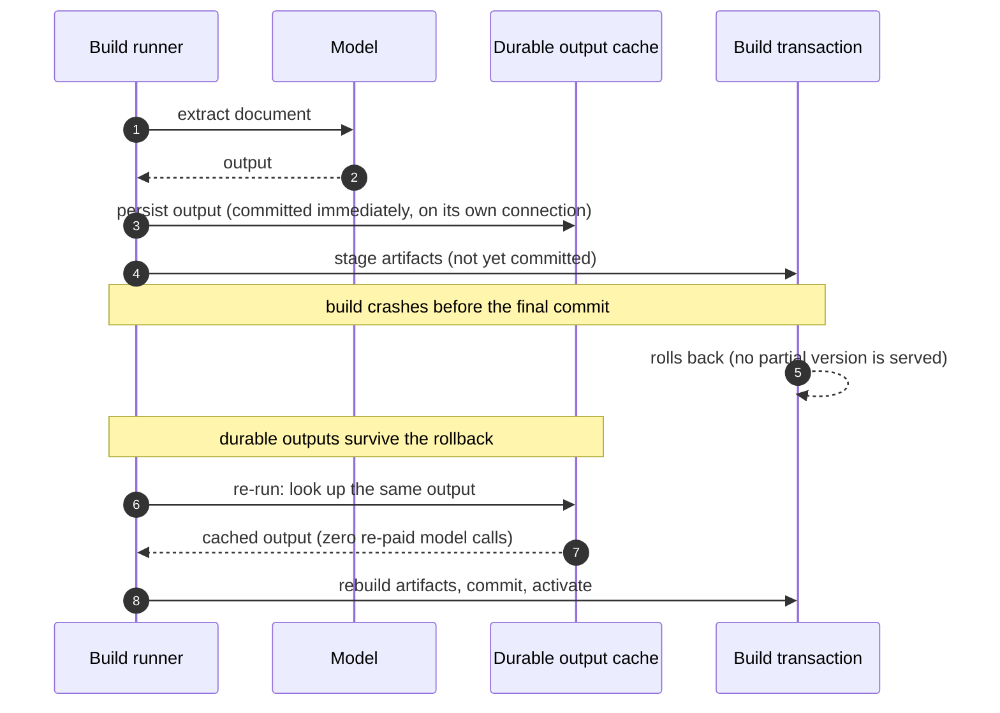
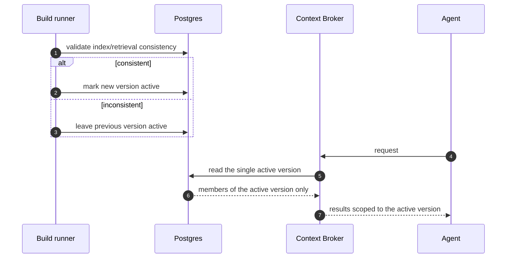
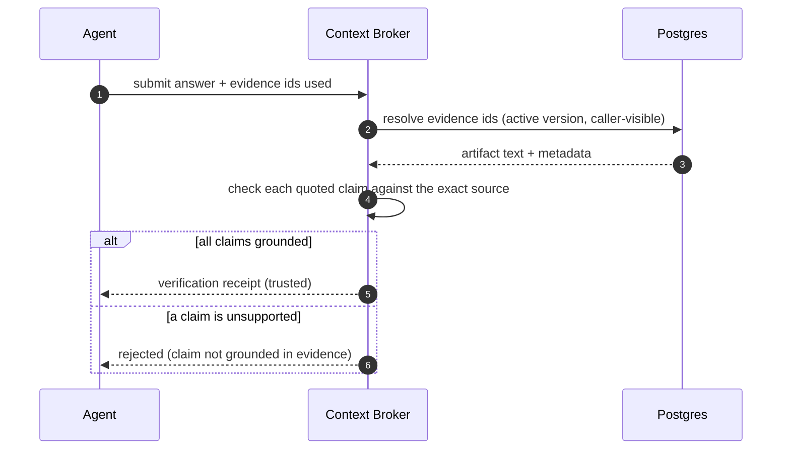

# Sequence diagrams

Runtime and build interactions, end to end.

## 1. Incremental build



## 2. Knowledge-first retrieval (the common path)

```mermaid
sequenceDiagram
    autonumber
    participant Dev as Developer
    participant Ag as Agent
    participant Br as Context Broker
    participant PG as Postgres

    Dev->>Ag: ask a question / request a change
    Ag->>Br: knowledge search (within budget)
    Br->>Br: authenticate + ACL filter
    Br->>PG: ranked search over active version
    PG-->>Br: candidate artifacts
    Br->>Br: rank (relevance, provenance, centrality), dedupe, cap
    Br->>PG: write retrieval event (audit)
    Br-->>Ag: evidence cards (cited)
    alt knowledge sufficient
        Ag-->>Dev: answer / code with citations
    else gap, stale, or exact code needed
        Ag->>Ag: read specific file (skeleton; exact body on demand)
        Ag-->>Dev: answer / code with citations
    end
```

## 3. Crash-resilient build (no re-paid work)



## 4. Version activation and serving



## 5. Provenance verification


